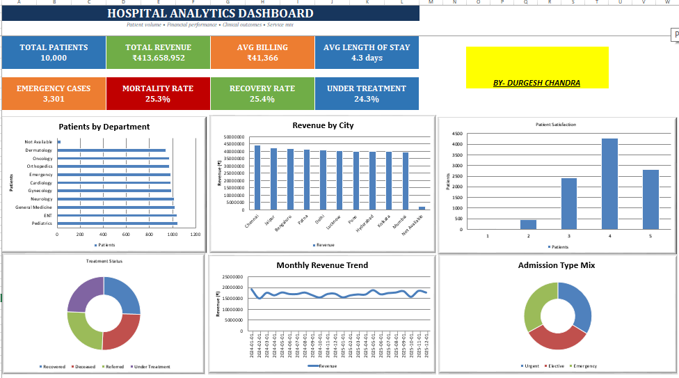

# Hospital-Data-Analysis-dashboard
Hospital data analysis and KPI Dashboard using microsoft excel
Hospital Data Analysis Dashboard

Hospital data analysis and KPI dashboard created using Microsoft Excel.

📌 Project Overview

This project focuses on analyzing hospital data to identify key performance indicators, patient trends, and operational insights. The data was cleaned, organized, analyzed, and presented through Excel-based KPI analysis and dashboard visualizations.

🎯 Project Objectives

- Clean and organize hospital data
- Analyze important hospital KPIs
- Understand patient and hospital activity
- Analyze admission and discharge information
- Identify useful trends and patterns
- Create an interactive and easy-to-understand dashboard

🧹 Data Cleaning

The dataset was prepared for analysis by:

- Removing duplicate records
- Cleaning inconsistent data
- Handling missing values
- Standardizing date-related data
- Checking data consistency
- Organizing columns for analysis

📊 Key KPIs

The project includes analysis of:

- Total Patients
- Total Admissions
- Total Discharges
- Average Length of Stay
- Total Revenue
- Average Revenue per Patient
- Patient Admission Analysis
- Patient Discharge Analysis
- Hospital Performance Metrics

📈 Analysis

The dashboard provides analysis of:

- Admission trends
- Discharge trends
- Patient analysis
- Revenue analysis
- Department-wise analysis
- Monthly trends
- Key hospital performance indicators

🛠️ Tools & Skills Used

- Microsoft Excel
- Data Cleaning
- Data Analysis
- Excel Formulas
- Pivot Tables
- Pivot Charts
- KPI Analysis
- Conditional Formatting
- Sorting & Filtering
- Dashboard Design

📷 Dashboard Preview

📁 Project File

- "Hospital_new dashboard analysis.xlsx" — Excel dataset, analysis, KPI calculations, and dashboard.

👨‍💻 Author

Durgesh Chandra

This project was created as part of my Data Analytics learning and portfolio development.
